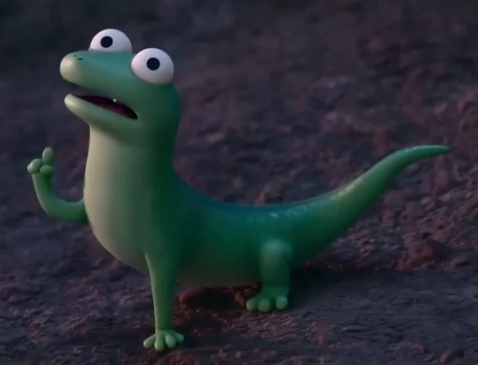

# 🦎 Tom Lizard — Not a Bot. A Presence.



---

## 👀 Look at him.

He’s not doing anything.

He’s just… there.

Watching. Thinking. Existing.

---

## 🧠 What is this?

Tom Lizard is an experimental AI project that tries to answer a weird question:

> What if a character didn’t just respond…
> but *lived*?

---

This is NOT:

* ❌ a chatbot
* ❌ a virtual assistant
* ❌ something that waits for input

---

This IS:

* 🧠 a continuously thinking entity
* 👀 a creature that sees you (via your camera)
* 🎭 a personality that changes over time
* 🔁 a system that runs even when you say nothing

---

## 🦎 Who is Tom?

Tom is small.
Tom is weird.
Tom is… a little off.

---

### 🎭 Personality

* 🤡 goofy without trying
* 😏 sarcastic for no reason
* 😐 sometimes just stares at you
* 💤 gets bored easily
* 🗣️ talks only when it *feels like it*

---

> He doesn’t perform.
> He exists.

---

## 🎯 Core Idea

> “Make something that feels alive… even in silence.”

---

## 🧠 Behavior Philosophy

```text id="j3r6vz"
Think often
Act sometimes
Speak rarely
```

---

## 👀 Yes, it can SEE you

Tom uses your computer camera.

Not for creepy stuff. Relax.

Just enough to:

* detect presence
* notice movement
* react when you look at him

---

### Example:

* You stare → he looks back
* You ignore him → he gets bored
* You leave → he “zones out”

---

## 🔁 The Loop (The Heart of It All)

```text id="v1gxtx"
observe → think → decide → act → repeat
```

This runs **forever**.

Even when you’re not interacting.

---

## 🧠 Internal Life

Tom has:

* mood → happy / bored / annoyed
* energy → drains over time
* state → ACTIVE / SILENT / SLEEPY / ENTERTAINED

---

### 😴 If nothing happens…

He will:

* stop reacting
* slow down
* fall asleep

---

### 😏 If you annoy him…

He might:

* ignore you
* respond late
* say something mildly rude

---

### 🤫 If you tell him to shut up…

He will.

But he’ll still look at you.

---

## 🔊 Talking (When He Feels Like It)

Tom does NOT:

* talk constantly
* respond instantly
* behave like a tool

---

He will:

* speak randomly (rarely)
* react to events
* say short, expressive things

---

> Silence is part of his personality.

---

## 💻 How It Works

```text id="8fpxr6"
Web App (UI)
   ↓
Camera (Vision)
   ↓
Google Colab (Tesla T4)
   ↓
Local AI Brain (NO API)
   ↓
Behavior Engine
   ↓
Actions (text / animation)
```

---

## ❗ No API. No Cloud Dependency.

Everything runs:

* 📓 inside Google Colab
* ⚡ using Tesla T4 GPU
* 🧠 with local LLM models

---

No external API calls.
No hidden magic.

Just your code. And Tom.

---

## 🌐 Web Simulation

You don’t need the robot (yet).

The web app simulates Tom:

* 🦎 animated lizard
* 👀 moving eyes
* 😐 idle behavior
* 💬 chat box
* 🔁 real-time loop

---

> He sits in a corner of your screen… doing his thing.

---

## 🧪 Example Moments

* You open the page → he glances at you
* You stare → he stares back
* You say nothing → he eventually sighs
* You say “shut up” → silence… but judgmental silence

---

## 🧠 Under the Hood

* Python
* Transformers (HuggingFace)
* Local LLM (Mistral / LLaMA)
* OpenCV (camera input)
* Simple Web UI (HTML/JS)

---

## 🔁 Core Loop (Simplified)

```python id="z7u4sn"
while True:
    observe_environment()
    update_state()
    think()
    decide()
    act()
```

---

## 🎯 Final Goal

Not intelligence.

Not performance.

---

> Presence.

---

Something that makes you feel like:

> “Why does it feel like this thing is actually… there?”

---

## 🦎 Final Note

Tom doesn’t need to move much.
He doesn’t need to talk much.

---

He just needs to exist…

…and let your brain do the rest.
